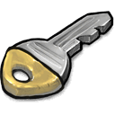

<br/>
<p align="center">
  <a href="https://github.com/KevinDev64/ScienceDayBreak">
    
  </a>

  <h3 align="center">Certificate Issuing Service</h3>

  <p align="center">
    Make your life easier :sunrise: and more organized :hearts:!
    <br/>
    <br/>
    <a href="https://github.com/KevinDev64/ScienceDayBreak/issues">Report Bug</a>
    .
    <a href="https://github.com/KevinDev64/ScienceDayBreak/issues">Request Feature</a>
  </p>
</p>

    


## Table Of Contents

* [About the Project](#about-the-project)
* [Getting Started](#getting-started)
  * [Prerequisites](#prerequisites)
  * [Installation](#installation)
* [Roadmap](#roadmap)
* [Contributing](#contributing)
* [License](#license)
* [Authors](#authors)

## About The Project


This project is a wonderful prototype(MVP) of a certifice issuing service for Sirius ecosystem.
And that's why:
* :sparkling_heart: User-friendly site interface with 2 themes(dark/light)
* :blush: Intuitive, well-thought-out for all ages
* :money_with_wings: Easy launch and setup in your own ecosystem
* :sparkles: HTML+CSS templates for certificates and email distribution
* :sunglasses: Advanced security. Don't worry about it 
* :crown: Roles administration(user/operator/admin)
* :construction: Configured Jenkins for CI/CD pipeline

Many new features will be added over time. The project is waiting for your suggestions for new features or changes :smile:


## Getting Started

This section describes basic settings and installation of required packages. Before doing this, you need to install the Docker Engine on your computer/server!

### Prerequisites

Here's how to set up a virtual environment

* Create a virtual environment and activate it

```sh
python -m venv venv
source venv/bin/activate # Linux
```

### Installation

1. Set up your email server. (We recommend use Mailcow [https://github.com/mailcow/mailcow-dockerized](https://github.com/mailcow/mailcow-dockerized))

2. Set up your Jenkins [https://www.jenkins.io/](https://www.jenkins.io/)

3. Clone the repo

```sh
git clone https://github.com/kevindev64/ScienceDayBreak.git
```

4. Move into repo directory

```sh
cd ScienceDayBreak
```

5. Generate .env file with env-gen.py script

```sh
./env-gen.py
```

6. Build project

```sh
docker compose build
```

6.1 Later if you want, you can change the docker registry in docker-compose.yml and use pulling from it without building on your server

```sh
docker compose pull
```

7. Run!

```sh
docker compose up -d
```

7.1 If you want to shutdown

```sh
docker compose down 
```


## Known issues

See the [open issues](https://github.com/KevinDev64/ScienceDayBreak/issues) for a list of known issues.

## Contributing

Contributions are what make the open source community such an amazing place to be learn, inspire, and create. Any contributions you make are **greatly appreciated**.
* If you have suggestions for adding or removing, feel free to [open an issue](https://github.com/KevinDev64/ScienceDayBreak/issues/new) to discuss it, or directly create a pull request after edit.
* Please make sure you check your spelling and grammar.
* Create individual PR for each suggestion.

### Creating A Pull Request

1. Fork the Project
2. Create your Feature Branch (`git checkout -b feat/AmazingFeature`)
3. Commit your Changes (`git commit -m 'feat: Add some AmazingFeature'`)
3.1 If you have enabled commit signings, use it (`git commit -S -m 'feat: Add some AmazingFeature'`)
4. Push to the Branch (`git push origin feat/AmazingFeature`)
5. Open a Pull Request

## License

Distributed under the MIT License. See [LICENSE](https://github.com/KevinDev64/ScienceDayBreak/blob/main/LICENSE.md) for more information.

## Authors

* [KevinDev64](https://github.com/KevinDev64/) - *Team Lead, DevOps, SysAdmin*

* [Dima](https://github.com/NikName2021/) - *Backend developer, tester*

* [Artemy188](https://github.com/Artemy188/) - *Frontend developer*

* [josuealarcon135-hash](https://github.com/josuealarcon135-hash/) - *Designer*